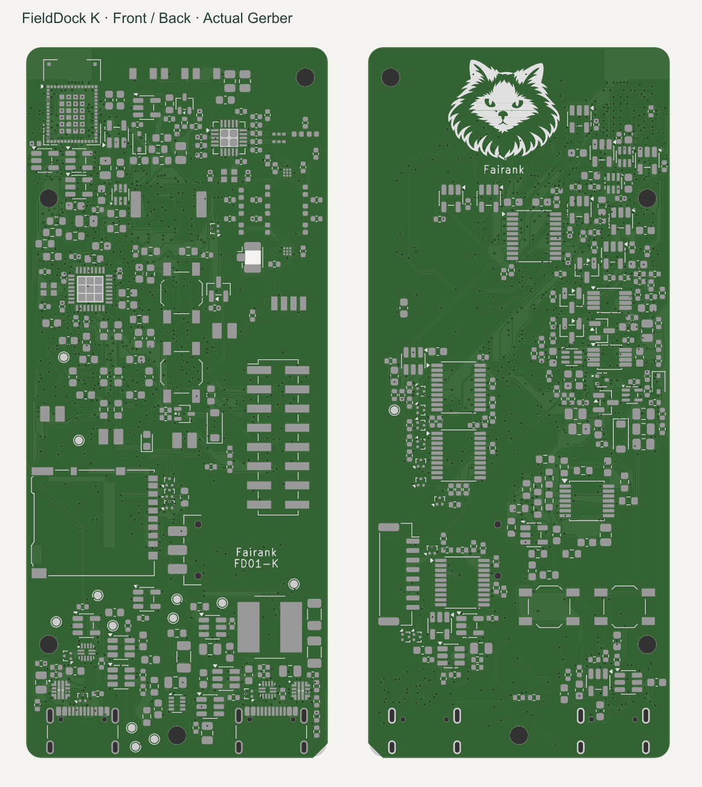
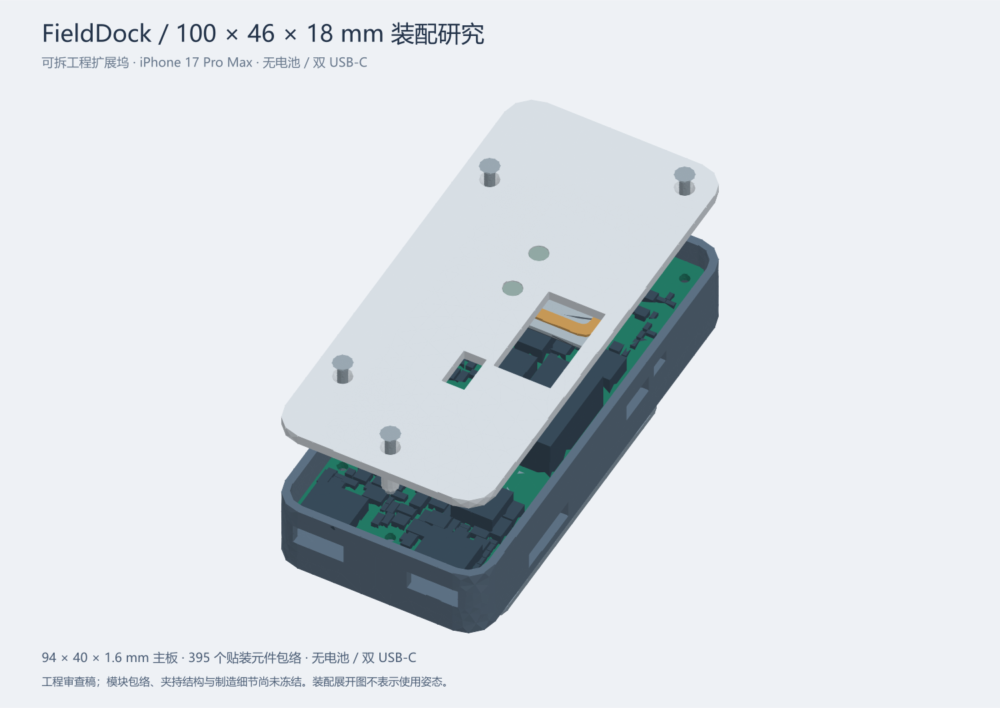

# FieldDock · Fairank / 年糕

面向 iPhone 17 Pro Max 的模块化无线与硬件实验工具。主板将 Sub-GHz、NFC、125 kHz RFID、红外、iButton、GPIO 和存储接口集中在 **94 × 40 mm** 的板上；手机承担未来的界面和结果处理。

**K 版全板布线与数字制造文件检查已完成。当前发布的是未制作、未上电的工程样板设计，尚未完成整机装配采购放行，也没有 Apple 认证或 Flipper 功能等效实测。**



## 本次交付

| 内容 | 文件 | 当前状态 |
|---|---|---|
| 可编辑电路与 PCB | [KiCad 工程](cad/FD-MAIN-01.kicad_pro)、[主板](cad/FD-MAIN-01.kicad_pcb)、[22 页原理图 PDF](schematic/FieldDock-schematic-K.pdf) | 全板布线；KiCad 10.0.6 ERC/DRC 通过 |
| 制造资料 | [Gerber / 钻孔 ZIP](manufacturing/FieldDock-PCB-K-fabrication.zip)、[加工要求](manufacturing/PROCESS-K.md)、[文件说明](manufacturing/README.md) | 已导出并独立核对几何；供应商 CAM 接单确认待完成 |
| 元件与贴装 | [BOM 复核表](manufacturing/BOM-review.csv)、[395 件贴装坐标](manufacturing/FD-MAIN-01-populated-pos.csv) | 位置已核对；部分采购料号、替代料和底面角度约定待厂家确认 |
| 结构设计 | [STEP / STL 模型包](mechanical/FieldDock-mechanical-K.zip)、[参数与生成脚本](mechanical/) | 16 个零件及组件包络；安装孔对应一致，未做实物公差验证 |
| 基础驱动 | [C 驱动与主机测试](firmware/) | CC1101 识别读取、电源预算策略、GPIO 映射；没有完整可烧录固件 |
| 可审阅证据 | [发布状态](release-status.json)、[检查记录](checks/)、[验证说明](VALIDATION.md) | 对应本次文件哈希 |

## 检查结果

- PCB DRC：**0 未连接、0 错误、0 警告**；原理图 ERC：**0 违规**。启用范围与五项默认忽略规则保留在原始报告中，不表示所有可选规则都已执行。
- 原理图、最终 PCB 和布线模型：**1,260 个已分配引脚连接一致**；57 个明确标记的未使用引脚单独核对。
- 独立 Gerber/Excellon 解析：核对 **11,385 段走线、899 个贯穿过孔、907 个金属化钻孔/槽、10 个非金属化孔**，八层铜、外形和装配坐标一致。
- 机械包络检查：50 对检查对象，无非预期交叠；4 处自攻螺钉与底孔材料交叠为设计预期。它不包含尺寸公差、插拔力和线束弯曲验证。
- 基础驱动通过主机测试与 Cortex-M4 freestanding 对象编译；尚未链接整机镜像或上板测试。

```sh
python tools/verify_artifacts.py
python tools/verify_artifacts.py --release
```

第二条命令核验本版**裸 PCB 工程样板文件**的数字检查条件，不代表供应商已接单、整机可量产或硬件功能已通过。脚本不会自动运行 KiCad。

## 硬件范围

主控为 STM32WB5MMG，射频采用 CC1101 与 ST25R3916，并设 LF RFID、红外、iButton、隔离 GPIO、microSD 及反馈控制电路。Sub-GHz、NFC 和 LF 的完整协议、读写能力与距离需要固件和样板分别验证。

两个 USB-C 分别用于手机数据/低功率输入与 AUX 固定 5 V 辅助输入，包含电源选择、限流和反向电流保护设计。**本版不含电池；两个端口的电流预算不能相加。** USB 为全速 12 Mbit/s，iPhone App 的有线数据通道尚未完成。没有增加所谓“iPhone 芯片”。

CSI、雷达、UWB、宽带 SDR、热成像和镜头检查作为外部探头方向保留；本次主板发布不等于这些探头及其算法已全部实现。Flipper 官方功能是参考目标，并未复制其固件或宣称兼容替代。仓库不包含无线网络干扰功能。

八层、1.6 mm、沉金、所有贯穿过孔树脂填孔盖帽；使用 0.30/0.15 mm 和 0.35/0.20 mm 过孔。**0.15 mm 机械钻孔是非常规加价工艺**，须按 [加工规格](manufacturing/PROCESS-K.md) 单独确认，不能按普通双层板下单。主板下单前须让厂家确认最终 CAM、叠层、填孔和阻抗条件。

## 外壳与安装



外壳目标 100 × 46 × 18 mm，安装背板另占约 1.6 mm。提供参数化源码、装配 STEP 以及各零件 STEP/STL；内部电子元件使用保守包络，并非全部来自原厂的精确三维模型。接口插拔、手机摄像头避让、固定强度、天线线圈与装壳后的射频表现仍需试装。

## 预算与后续验证

[工程预算](manufacturing/BUDGET-K.md)：单套核心样机约 **¥1,534–3,820**；两套合计约 **¥2,049–4,941**。这些是估算，**均未包含尚未报价的 0.15 mm 钻孔附加费**，也不含手机、外部探头、射频调试和返版，不是最终价格上限。没有下单或取得厂家正式报价。

下一步是供应商 CAM 与料号确认、限流上电、电源切换/倒灌测试、射频与线圈调谐、手机通信以及外壳试装。详见 [验证顺序](VALIDATION.md)。原生图纸保留设计过程的标题栏版本；本次发布以 `release-status.json` 和文件校验清单确定对应关系。

## 署名和使用

Copyright © 2026 fairank，限其依法可保护并有权许可的原创贡献。年糕图标为本项目品牌。

原创贡献以 [FieldDock 非商业许可](LICENSE) 提供源码，个人可委托收费代工制作自用样机；对许可材料的商业使用需另行获得书面许可。这是 **noncommercial source-available** 项目，不使用 OSI 开源标识。KiCad 库及其衍生部分保留上游许可，见 [第三方说明](THIRD_PARTY_NOTICES.md) 和 [逐文件来源清单](licensing/library-inventory.csv)。不主张对通用电路方法、技术事实或独立实现的排他权。
